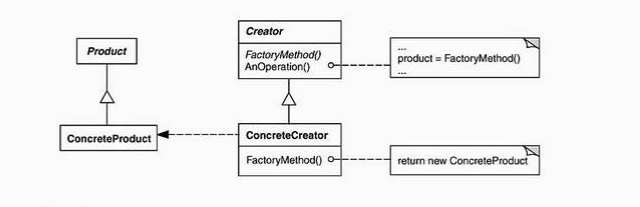
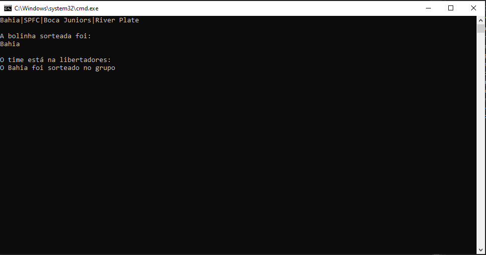

# Design Partterns - Factory Method
Ontem eu escrevi sobre o [Singleton](https://www.linkedin.com/pulse/design-partterns-singleton-mba-itil-capm-mcp-isfm-sfc-bec/?trackingId=4qd9c24ITh2A0%2BOWhToOfw%3D%3D) padrão de projeto importante para instanciarmos o objeto somente uma vez durante a execução do projeto. Esse artigo irei tratar de outro padrão de projeto de criação o *Factory Method.*

> "Abstração não deve depender detalhes, detalhes é quem deve depender de abstrações"

Ao analisar essa frase consigo enteder claramente o proposito do *Factory Method,*  em tempo de execução a fábrica instancia o objeto dinamicamente, o desenvolvedor não sabe antecipadamente qual será a necessidade do sistema, a estrutura do *Factory Method* delega a responsabilidade da instancia do objeto a uma classe fábrica.

Factory method também é conhecido como Construtor Virtual,o objetivo desse padrão é a possibilidade de criar uma fábrica de objeto em tempo de execução e deixar que objeto decida o seu tipo dinamicamente



O Facyory Method tem como objetivo principal resolver os seguintes problemas:

-  Antecipar o tipo de classe do objeto que deve ser criado. Pois tenho objetos de varios tipos
- Preciso delegar a responsabilidade para que as subclasses especifiquem os objetos que devem ser criados.

> "O padrão Factory method oferece uma solução. Ele encapsula o conhecimento sobre a subclasse que deve ser criada e move este conhecimento para fora do framework"

> Gamma Erich , Padrões de projeto: soluções reutilizaveis de software orientado a objetos ,2000 p 112

Imagina agora o sorteio da libertadores 2022 , quatro bolinhas para determinar os cabeças de chaves do grupos , essas bolinhas temos o Bahia(BBMP!!) , São Paulo Futebol Clube, Boca Juniors e o River Plate, sabemos que uma dessas bolinhas vai ser a escolhida mas so podemos "Instaciar" qual bolinha será no momento que for puxada e sorteada, é assim que funciona o padrão *Factory Method*  o objeto de uma subclasse só será instanciada no momento que for escolhida em tempo de execução.

Para o exemplo do Factory method criei um projeto disponível no Github **https://github.com/alessandrorsseixas/designfactorymethod**. Foi criada uma interface ITeam essa interface é a abstração de todos os times, pois times possuem caracteristicas em comum. Nessa interface será apenas implementado um metodo void que irá informar que o time foi sorteado.

```
public interface ITeam
    {
        void ChosenTeam();
    }
```

Após a interface serão criadas as classes que serão a representação dos times no sistema(Bahia,SPFC, Boca, River), essas classes implementam a interface ITeam. Abaixo o exemplo da classe Bahia.

```
public class Bahia : ITeam
    {
        public void ChosenTeam()
        {
            Console.WriteLine("O Bahia foi sorteado no grupo");
        }
    }
```

Agora que tenho as subclasses desenvolvidas é o momento de criar a classe que orquestrará a construção dos objetos da subclasse, essa é a classe Fábrica, a partir de um *input* nela a fábrica determina qual objeto será instanciado em tempo de execução.

```
public class FactoryMethod
    {
        public ITeam TeamChoice(string team)
        {
            switch (team)
            {
                case "Bahia":return new Bahia();
                case "SPFC": return new SPFC();
                case "Boca": return new BocaJuniors();
                case "River": return new Bahia();
                default:return null;
            }
        }
    }
```

 E para testar no main , vamos receber o input do usuário e a partir disso dinamicamente o objeto será instanciado.

```
static void Main(string[] args)
        {
            FactoryMethod factoryMethod = new FactoryMethod();
            Console.WriteLine("Bahia|SPFC|Boca Juniors|River Plate");
            Console.WriteLine("");
            Console.WriteLine("A bolinha sorteada foi:");
            string choice = Console.ReadLine();
            ITeam team = factoryMethod.TeamChoice(choice);
            Console.WriteLine("");
            Console.WriteLine("O time está na libertadores:");
            team.ChosenTeam();
            Console.ReadKey();
        }
```



E assim concluo o entendimento de mais um padrão de criação o Factory Method.

Referência

- Gamma Erich , Padrões de projeto: soluções reutilizaveis de software orientado a objetos ,2000, Editora bookman